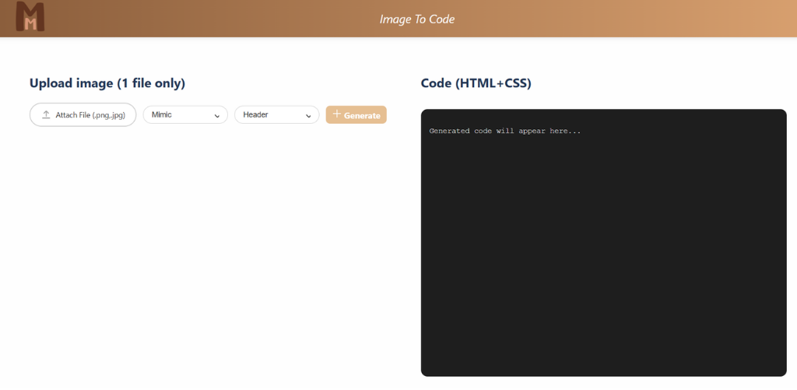
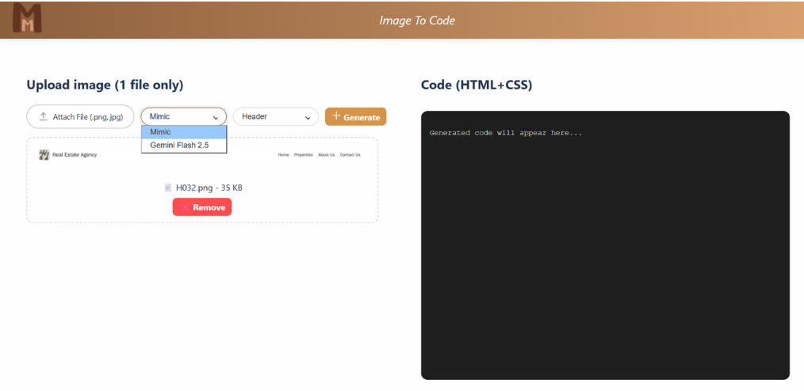
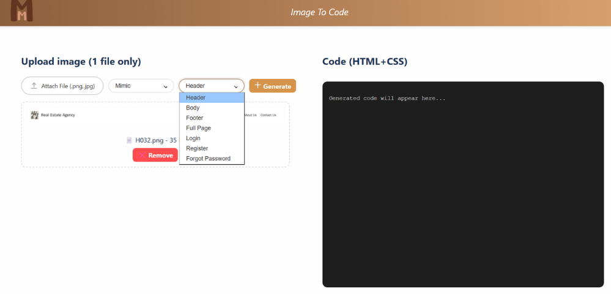
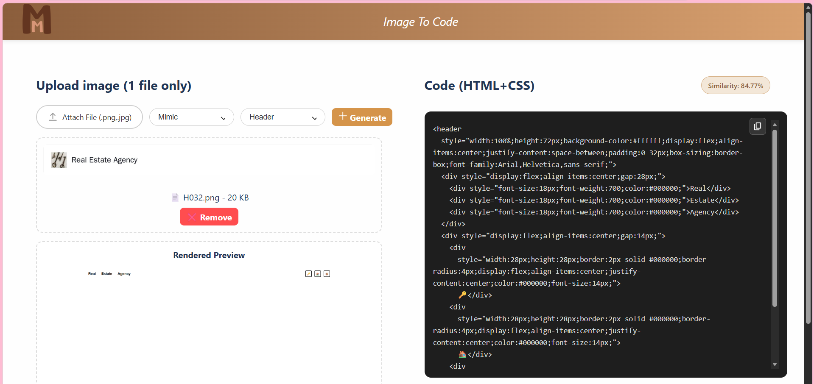

# Image-to-Code Generation Using Vision-Language Model (mimic)

## Overview
This project is a web-based application that converts user interface (UI) images into HTML with inline CSS using Vision-Language Models. The system allows users to upload UI images, choose a generation engine, and receive generated HTML code, rendered preview output, and similarity evaluation results.

The project was developed to reduce the time and manual effort required to translate UI designs into frontend code. It focuses on generating HTML with inline CSS for static web interface structures. The system includes a custom fine-tuned model called **Mimic**, which was trained and improved specifically for UI image-to-code generation, alongside **Gemini Flash 2.5** as an additional generation option.

## Objectives
- Develop a web application that converts UI images into HTML with inline CSS
- Study and apply Vision-Language Models for image-to-code generation
- Fine-tune a Vision-Language Model using LoRA for UI-to-HTML tasks
- Compare multiple Model engines for image-to-code generation performance
- Provide generated output together with similarity-based evaluation

## Features
- Upload UI images in PNG or JPG format
- Select Model engine for code generation
- Support multiple component modes:
  - Header
  - Body
  - Footer
  - Full Page
  - Login
  - Register
  - Forget Password
- Generate HTML with inline CSS
- Display generated code in the web interface
- Show rendered preview of the generated result
- Calculate and display similarity score for evaluation

## Project Structure
- `frontend/` : web interface for image upload, model selection, component selection, code display, preview, and similarity score
- `backend/` : API handling, image processing, model communication, rendering, and evaluation logic
- `colab/` : Colab-based scripts for Mimic model training and inference API serving
- `assets/screenshots/` : project screenshots for mimic presentation

## Tech Stack
### Frontend
- Vue 3
- Vite

### Backend
- FastAPI
- Python

### AI / Model
- LLaVA-NeXT
- LoRA (Low-Rank Adaptation)
- Custom fine-tuned Mimic model
- Gemini Flash 2.5 API
- Google Colab

### Evaluation / Utilities
- Playwright
- OCR-based text comparison
- Visual similarity metrics

### Colab Components
- mimic_training_colab.py : used for fine-tuning the Mimic model with LoRA
- mimic_inference_api_colab.py : used for running the Mimic inference API that receives UI images and returns generated HTML

## Workflow
1. User uploads a UI image
2. User selects the Model engine
3. User selects the component mode
4. Frontend sends the image to backend
5. Backend forwards the request to the selected model pipeline
6. The model generates HTML with inline CSS
7. Backend renders the generated HTML into an image
8. The system compares the rendered result with the original UI image
9. The generated code, preview, and similarity score are returned to the user

## Similarity Evaluation
The system evaluates generated results using four visual aspects:
- Text Similarity
- Color Similarity
- Shape Similarity
- Layout Similarity

These scores are combined into one overall similarity score displayed on the web interface.

## My Role
- Designed and prepared the UI image dataset for training
- Fine-tuned the Mimic model by myself using LoRA for UI image-to-code generation
- Improved and adjusted the LoRA-based training approach to better fit the project task
- Developed the web-based workflow for UI image upload and code generation
- Integrated frontend and backend for model inference and result display
- Supported engine-based generation using Mimic and Gemini
- Implemented preview rendering and similarity score presentation
- Worked on evaluation logic for generated output comparison

## Screenshots
### Upload Pic


### Select Model


### Select Component


### Generated HTML Result and Preview Result and Similarity Score


## How to Run

### Frontend
```bash
cd frontend
npm install
npm run dev
````

### Backend
```bash
cd backend
pip install -r requirements.txt
uvicorn main:app --reload
```

## Notes
* This project focuses on generating HTML with inline CSS from UI images
* It is intended for static UI structure generation rather than full interactive web functionality
* Output quality depends on the complexity and clarity of the input UI image
* The Mimic workflow is separated into training and inference API components for better maintainability

## Project Status
Final Year Project

Kasetsart University Sriracha Campus
